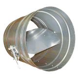
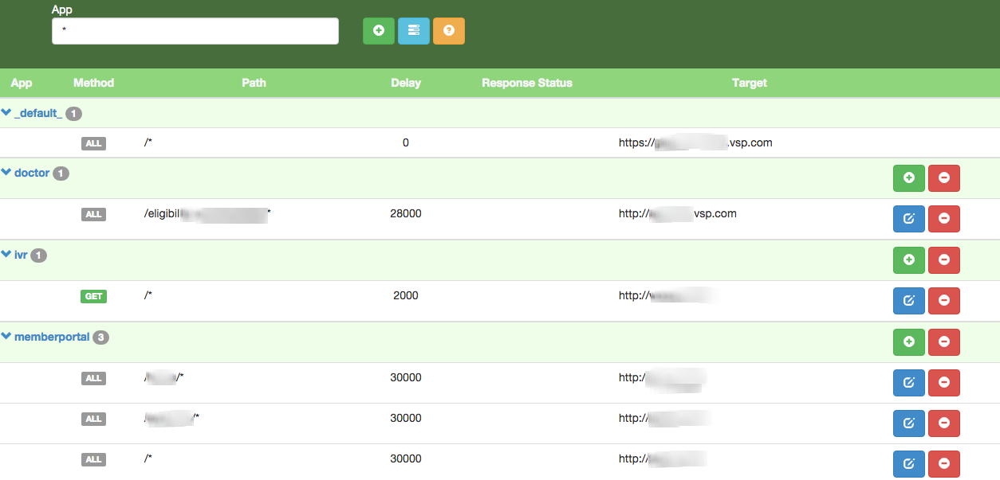

 

# DAMP 
[![NPM version][npm-version-image]][npm-url] [![Apache2 License][license-image]][license-url] [![Build Status][travis-image]][travis-url]

```
(verb) - /dæmp/ -  to check or retard the energy, action, etc., of; deaden; dampen; to stifle or suffocate; extinguish
```

This is a utility to control the responses from APIs via a proxy through various configuration mechanisms. You can force errors or delays on specific API invocations.  Also known as the **D**ynamically **A**rranged **M**ocking **P**roxy


# Prerequisites
You will need **Node.js >= v0.12** 

For RHEL machines, just run `yum install npm`.

If you need to upgrade or install Node.js on your workstation, the easiest way is to use an installer for your platform. Download the .msi for Windows or .pkg for Mac from the [NodeJS website](https://nodejs.org/download/).

# Running from NPM
Run the following to install from NPM:

```
npm install -g damp
```

Then you can execute with `damp`

# Running from Docker
Here's an example of running as a Docker container:

```
docker run -d -p 8000 -name "damp" \
-v /host/path/to/damp_routesets:/opt/damp/routesets \
-e PORT=8000 \
-e DEFAULT_TARGET=https://localhost:8080 \
-e APP_CONFIG_PATH=/opt/damp/routesets \
docker.vsp.com:443/gts-ea/damp
```

# Running from source 
Alternatively, if you want to run from the source then clone the repo locally and then from within the local directory run `npm install` and `sudo npm link`

Then you can execute with `damp`


# Runtime Options
Start the proxy by running `damp`.  Configuration can be provided by environment variables or command options:

**Command Option** | **Environment Variable** | **Default Value** | **Description**
-----------|-------------|------------|--------------
-c, --config | CONFIG_PATH | .damp.yml | Path to proxy config 
-a, --appconfig | APP_CONFIG_PATH | $(os.tmpdir)/damp/ | Path to app proxy configs 
-X, --appheader | APP_HEADER | X-TransactionId | Header to use for app routesets
-t, --target | DEFAULT_TARGET |  http://localhost:8080 | Proxy target
-d, --delay | DEFAULT_DELAY | 0 | Delay in milliseconds
-p, --port | PORT | 8000 | Port to listen on

# Configuration via UI
A user interface exists for managing application specific configuration.  DAMP can be run as a shared service in your testing environment.  For example inside VSP we have a shared instance available at [http://damp.vspglobal.com](http://damp.vspglobal.com).  When running locally, you can access it at [http://localhost:8000](http://localhost:8000).

 


# Configuration via YAML
You can configure specific paths in a YAML file.  By default, it looks for a file named **.damp.yml** in the current directory.  Here's a sample file with a couple paths, one with a custom delay and another with a custom status code:

```
## 30 second delay and custom target for '/home'
- path: /home
  delay: 30000
  target: http://gtssbxlb-0002.vsp.com
## 1 second delay with custom status (401) for '/as/*' with wildcard
- path: /as/*
  delay: 1000
  status: 401
```

# Configuration via API
The API consists fo the following resources:

**Method** | **Path** | **Input** | **Output**
-----------|-------------|------------|--------------
GET | `/_api` | none | Map of resources (key: resource name, value: URL) 
GET | `/_api/routesets?all` | `all` - load all routesets from disk (Default: false) | Array of routesets JSON
POST | `/_api/routesets` | `body` - Routeset JSON to create | none
GET | `/_api/routesets/:name` | `:name` - name of routeset to get | Routeset JSON
PUT | `/_api/routesets/:name` | `:name` - name of routeset to update <br/> `body` - Routeset JSON to update | Routeset JSON
DELETE | `/_api/routesets/:name` | `:name` - name of routeset to delete | none

The routeset data model looks like:

```
{
    "name": "foo",
    "routes": [
      {
        "path": "/bar/*",
        "status": 500,
        "target": "http://www.baz.com",
        "delay": 0
      }
     ]
  }
```

Choose either a `status` or a `target` for whether you intend to return a static response or proxy the request respectively.

# Runtime Routing
Every request that arrives at the proxy runs through a series of routes and applies **ALL** routes that match the `path` (in order of most specific path to least specific) until either a `status` or `target` route is found.

Routesets are loaded in the following order:

* **Request Routeset** - The request is interrogated to determine if a specific routeset is configured.  This is done in the follow order and once a routeset is matched, it is used and the subsequent steps are skipped:
    * `appheader` with `damp-appname` - if the request has a header with name matching the `appheader` configured and the value matches `damp-appname:<myapp>` then a routeset named *myapp* is loaded (ie. /_api/routesets/myapp).  If it exists, it will be used.
    * `appheader` with `damp-routeset` - if the request has a header with name matching the `appheader` configured and the value matches `damp-routeset:<base64>` then a routeset is decoded from the Base64 encoded JSON in *base64* and will then be used.
    * `Host` header - if the request has a `Host` header with name matching `myapp.damp.vspglobal.com` (which resolved from the \*.damp.vspglobal.com wildcard DNS), then a routeset named *myapp* is loaded.  If it exists, it will be used.
 
* **Static Routeset** - After all the routes in the **Request Routeset** resolve, if no `target` or `status` routes are found, then the static routeset is loaded from the `config` option provided at runtime.

* **Default Routeset** - After all the routes in the **Request Routeset** resolve and the routes in the **Static Routeset** resolve, if no `target` or `status` routes are found, then the defalut route is resolved based on the `delay` and `target` provided at runtime.


# Support
Please [create an issue](https://github.com/vspglobal/damp/issues) for any bugs you come across or feature requests.

# Contributing
[Pull requests](http://help.github.com/send-pull-requests) are welcome; see the [contributor guidelines](CONTRIBUTING.md) for details.


# License
IP is licensed under the [Apache License, Version 2.0](http://www.apache.org/licenses/LICENSE-2.0).

For additional information, see the [LICENSE](LICENSE) file.

  
[license-image]: http://img.shields.io/badge/license-APACHE2-blue.svg?style=flat
[license-url]: LICENSE

[npm-url]: https://npmjs.org/package/damp
[npm-version-image]: http://img.shields.io/npm/v/damp.svg?style=flat

[travis-url]: http://travis-ci.org/vspglobal/damp
[travis-image]: http://img.shields.io/travis/vspglobal/damp.svg?style=flat
